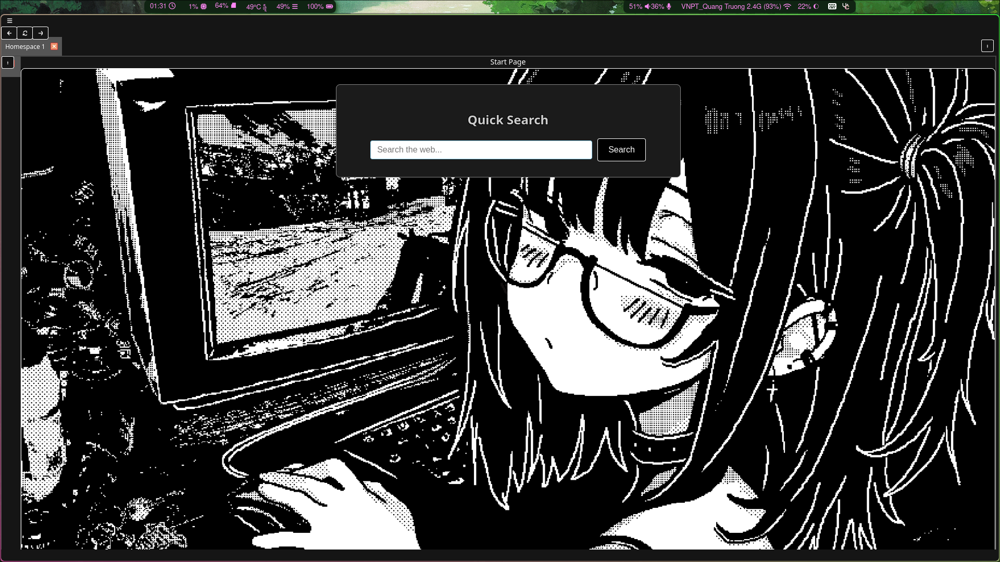

████████╗██████╗ █████╗ ██████╗ ██╗ ██╗███╗ ██╗██╗ ██╗████████╗██╗ ██╗
╚══██╔══╝██╔══██╗██╔══██╗██╔═══██╗██║ ██║████╗ ██║██║ ██║╚══██╔══╝██║ ██║
██║ ██████╔╝███████║██║ ██║██║ ██║██╔██╗ ██║██║ ██║ ██║ ███████║
██║ ██╔═══╝ ██╔══██║██║ ██║██║ ██║██║╚██╗██║██║ ██║ ██║ ██╔══██║
██║ ██║ ██║ ██║╚██████╔╝╚██████╔╝██║ ╚████║╚██████╔╝ ██║ ██║ ██║
╚═╝ ╚═╝ ╚═╝ ╚═╝ ╚═════╝ ╚═════╝ ╚═╝ ╚═══╝ ╚═════╝ ╚═╝ ╚═╝ ╚═╝
# 🚀 Tragunyth — Thinh’s Custom Web Browser  

  

---

## 🌌 Overview  
**Tragunyth** is a lightweight, minimal, and blazing-fast custom web browser built with Qt and C++.  
It is designed from the ground up to prioritize **simplicity**, **clarity**, and **user control**, all while packing an innovative feature: the **Homespace System**.  

Forget cluttered toolbars and bloated menus — Tragunyth gives you the **essentials only**, wrapped in a sleek modern design.  

---

## ✨ Features  

### 🪶 Lightweight & Minimal UI  
- No unnecessary UI bloat — just your pages, cleanly displayed.  
- Dark, modern theme that blends with your content instead of fighting it.  
- Designed to feel **native**, responsive, and distraction-free.  

### 🧠 Genius Homespace System  
- Traditional browsers only have *tabs*. Tragunyth introduces **Homespaces**:  
  - Each Homespace is a container for its own set of tabs.  
  - Organize your work, play, and research into **separate spaces** without chaos.  
  - Switch between Homespaces like virtual desktops — but for your browsing.  
- Comes with a **quick “+” button** to spawn new Homespaces instantly.  
- Each Homespace starts with your **custom Start Page** for quick searching & navigation.  

### 🎛️ Essential Navigation  
- **Back, Forward, Reload** buttons — the basics you need, nothing more.  
- **Custom Start Page** with integrated DuckDuckGo search and quick links.  
- Every tab shows a **live title label** synced with the page.  

---

## 🔥 Why Tragunyth?  
- Because you don’t need a **100 MB monster browser** to load a webpage.  
- Because you deserve a UI that **respects your space** and doesn’t hog your screen.  
- Because Homespaces are a **genius upgrade to tabs** — why hasn’t anyone done this before?  
- Because it’s **fun, hackable, and yours**.  

---

## 🛠️ Tech Stack  
- **C++ / Qt 6**  
- **QtWebEngine** (Chromium under the hood, lightweight & integrated)  
- Custom **QTabWidget hacks** for Homespaces and tab organization  
- **Dark stylesheet** for modern look & feel  

---

## 📸 Screenshots  

**Homespace in Action**  
  

---

## 🚧 Roadmap  
- [ ] Bookmarks manager  
- [ ] Custom themes  
- [ ] Tab persistence between sessions  
- [ ] Homespace export/import  

---

## 💡 Final Note  
Tragunyth is **more than a browser**.  
It’s your **personal web environment**, built on principles of minimalism and smart design.  
Try it, and you may never go back to ordinary tabs.  

